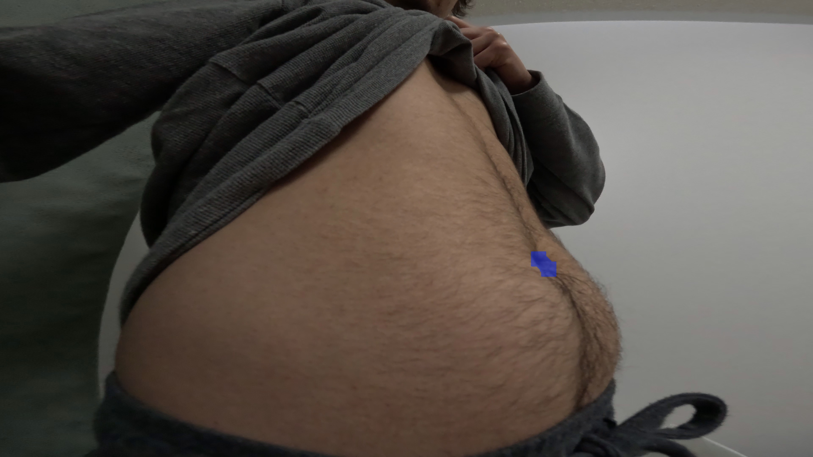
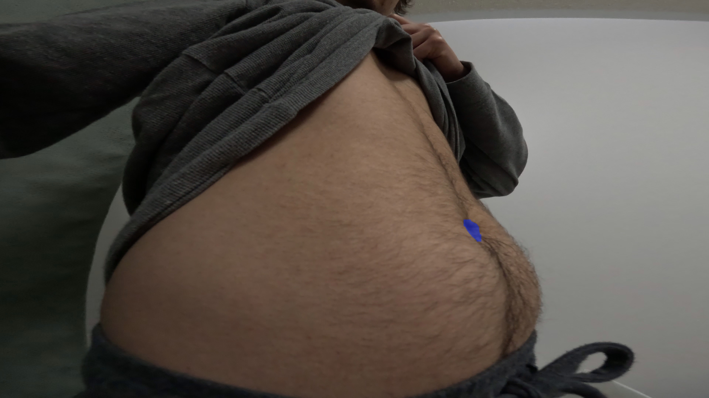
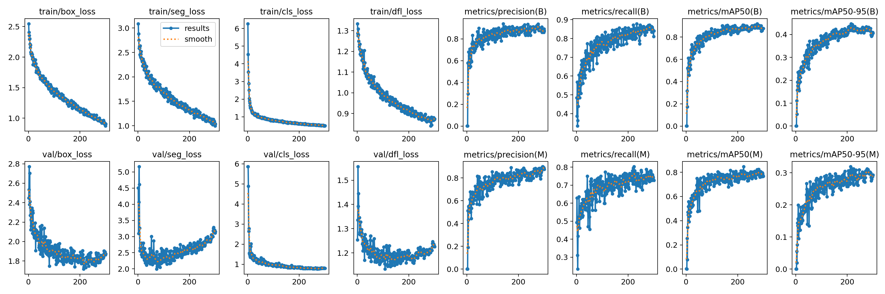
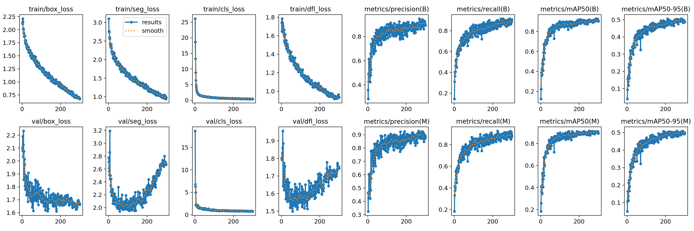
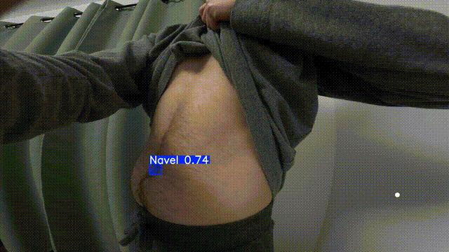

# Injection Tracker: Final Report

## Introduction

This project investigates the use of a YOLO-based computer vision model for navel segmentation, as a step toward developing an automated insulin injection site tracking system.

Over the term, I iteratively expanded and refined the dataset, trained a sequence of models, and evaluated their performance and runtime characteristics with consideration for deployment on a resource-constrained edge device. The report focuses on how specific design choices — including data format, image resolution (`imgsz`), and training hyperparameters — affect both segmentation quality and practical feasibility.

## Methods

- **Model and hardware**
  - All experiments used a pretrained Ultralytics YOLOv11 segmentation model, fine-tuned on a custom dataset in Python.
  - Training was conducted on Google Colab, using both NVIDIA T4 and A100 GPUs.
  - Inference latency was measured on a MacBook Air (M1) to assess performance on an edge-class device.

- **Data collection and labeling**
  - Short videos orbitin the abomen were recorded using a GoPro Hero 11 Black camera under a variety of lighting and posture conditions (daylight, indoor lighting, bathroom lighting, outdoor daylight, and low-light with a flashlight). Frames were extracted using custom preprocessing scripts.
  - The widest field of view (FOV) was used to maximize the likelihood of capturing the navel within the frame, even when the camera was positioned close to the abdomen.
  - Images were annotated in CVAT to produce segmentation masks for the navel region.

- **Evaluation protocol and metrics**
  - Each model was evaluated on a held-out validation set corresponding to its training run.
  - Evaluation followed the default YOLO metrics:
    - **Precision (P)**: proportion of predicted detections that are correct.
    - **Recall (R)**: proportion of ground-truth objects correctly detected.
    - **mAP@50**: mean Average Precision at an IoU threshold of 0.5, reflecting detection/segmentation quality under a moderate overlap criterion.
    - **mAP@50–95**: mean Average Precision averaged over IoU thresholds from 0.5 to 0.95, providing a stricter and more comprehensive measure of localization and mask quality.

## Dataset and Training Summary

### First Model: Proof of Concept

The first training run served as a proof of concept to evaluate whether a YOLO segmentation model could reliably identify and segment the navel. Three short video clips were collected under varied lighting and posture conditions (daylight, indoor lighting, sitting, and standing). Frames were extracted at 3 fps, yielding 264 images in total. Two-thirds of the frames were used for training, while the remaining 99 images (36.7%) were held out for validation.

Although this split was not ideal, the goal at this stage was simply to assess model feasibility. The model was trained for 120 epochs using YOLO’s default hyperparameters. Despite the small dataset, early results demonstrated promising segmentation capability.

#### Results

Due to an issue with persistent storage in Colab, the original training graphs were not saved. However, the final performance metrics on the validation set were recorded as follows:

| Metric | Box | Mask |
|:--|--:|--:|
| Precision (P) | 0.789 | 0.639 |
| Recall (R) | 0.394 | 0.355 |
| mAP@50 | 0.479 | 0.370 |
| mAP@50-95 | 0.145 | 0.099 |

These results — along with qualitative tests on a live webcam feed — confirmed that the model could detect and segment the navel, though with limited accuracy. The relatively low mAP@50–95 scores highlight insufficient localization precision and segmentation quality, likely due to the small dataset size and lack of visual diversity.

The next phase of experimentation focused on expanding the dataset and improving model robustness across lighting and posture variations.

### Second Model: Expanded Dataset and Negative Samples

During a live demonstration with Prof. Bruce, the first model exhibited two key issues:

1. **False positives**, such as detecting the navel on the ceiling.
2. **Poor detection** when the abdomen was compressed (e.g., when sitting hunched over).

To address these issues, the dataset was expanded and negative images (frames without a visible navel) were introduced. Initially, the negatives were stored in a separate folder, but were later mixed into the same directories as positive samples under the assumption that it would not affect training. In retrospect, it would have been preferable to keep them separate to maintain explicit control over which negatives were included. In total, 40 negatives were stored in their own folder, with additional negatives implicitly present in other directories. During training, YOLO reported 62 background images, indicating that 22 negatives were included implicitly.

## Data Collection

Additional data was captured under a broader range of lighting conditions to improve robustness:
- Low-light indoor scenes illuminated by a flashlight
- Outdoor daylight conditions  
- Bathroom lighting conditions  

All new frames were saved as PNGs rather than JPEGs (the format used in the first dataset). PNGs preserve high-frequency detail that is useful for learning fine segmentation boundaries. While this change introduced inconsistency between datasets, it may have unintentionally improved generalization by exposing the model to subtle JPEG compression artifacts in earlier runs.

The model was trained for 300 epochs (compared to 120 in the first model), with all other hyperparameters kept at YOLO’s default values.

#### Dataset Composition

| Folder        | Images |
|:--------------|-------:|
| 1             | 76 |
| 2             | 113 |
| 3             | 157 |
| Bathroom      | 116 |
| Flashlight    | 150 |
| Negatives     | 47 |
| Outdoors      | 70 |
| **Total**     | **729** |

Although there was mild imbalance across lighting conditions, the dataset size was not large enough to justify truncation to uniform counts per condition. Instead, stratified sampling was used to maintain proportional representation in the training and validation splits. Future datasets will aim for more balanced sampling across conditions.

#### Performance Metrics

| Metric | Box | Mask |
|:--|--:|--:|
| Precision (P) | 0.918 | 0.885 |
| Recall (R) | 0.871 | 0.795 |
| mAP@50 | 0.909 | 0.812 |
| mAP@50-95 | 0.443 | 0.312 |

#### Comparison to the First Model

The expanded dataset produced a model that is substantially more robust and capable of accurate segmentation under a wider variety of conditions. Testing on a live webcam feed confirmed that the second model correctly segmented the navel even when the abdomen was compressed, whereas the first model failed to do so. False positives were also greatly reduced, consistent with the higher precision observed in both box and mask metrics.

| Metric | Box (First Model) | Box (Second Model) | Mask (First Model) | Mask (Second Model) |
|:--|--:|--:|--:|--:|
| Precision (P) | 0.789 | 0.918 | 0.639 | 0.885 |
| Recall (R) | 0.394 | 0.871 | 0.355 | 0.795 |
| mAP@50 | 0.479 | 0.909 | 0.370 | 0.812 |
| mAP@50-95 | 0.145 | 0.443 | 0.099 | 0.312 |

### Third Model: Second Dataset, Larger Image Size

While the previous training runs used an image resolution of 640 × 640, this model was trained with an increased resolution of 1280 × 1280 (imgsz=1280). YOLO automatically determined the batch size based on the available GPU memory (40 GB on the NVIDIA A100), resulting in a batch size of 16. All other hyperparameters remained identical to those used for the second model.

#### Performance Metrics

| Metric | Box | Mask |
|:--|--:|--:|
| Precision (P) | 0.903 | 0.911 |
| Recall (R) | 0.826 | 0.833 |
| mAP@50 | 0.899 | 0.892 |
| mAP@50-95 | 0.501 | 0.441 |

#### Comparison with the Second Model

The second model achieved slightly higher box precision, recall, and mAP@50, indicating that it produced a greater number of correct detections overall. However, the third model achieved a higher box mAP@50–95, suggesting that although it detected fewer boxes, the ones it did predict were more accurately localized.
For segmentation masks, the third model outperformed the second in all metrics, with a particularly large improvement in mAP@50–95 (0.441 vs 0.312). This indicates that increasing image resolution allowed the model to learn from finer spatial details, leading to more precise segmentation boundaries.

| Metric | Box (Second Model) | Box (Third Model) | Mask (Second Model) | Mask (Third Model) |
|:--|--:|--:|--:|--:|
| Precision (P) | 0.918 | 0.903 | 0.885 | 0.911 |
| Recall (R) | 0.871 | 0.826 | 0.795 | 0.833 |
| mAP@50 | 0.909 | 0.899 | 0.812 | 0.892 |
| mAP@50-95 | 0.443 | 0.501 | 0.312 | 0.441 |

### Fourth Model: Second Dataset, Largest Image Size

This model was trained with an image size of 2560 × 2560 (imgsz=2560). YOLO automatically selected a batch size of 4, given GPU memory constraints. All other hyperparameters were identical to those used in the second and third models.

#### Performance Metrics

| Metric | Box | Mask |
|:--|--:|--:|
| Precision (P) | 0.899 | 0.887 |
| Recall (R) | 0.879 | 0.890 |
| mAP@50 | 0.903 | 0.910 |
| mAP@50-95 | 0.504 | 0.508 |

#### Comparison with the Third Model

Box-level performance remained largely similar between the two models, with the fourth model showing a clear improvement in recall (0.879 vs 0.826). This indicates that it successfully detected a greater proportion of navel regions. Mask recall also increased correspondingly, which is expected since segmentation performance is bounded by detection accuracy.

Although the third model achieved slightly higher mask precision, the mAP@50 and mAP@50–95 scores are higher for the fourth model, indicating that its predicted masks were more spatially accurate overall. These results further support the hypothesis that larger training images preserve fine-grained texture and edge information, improving segmentation fidelity.

However, the gains in accuracy come at the cost of significantly reduced inference speed due to the higher input resolution. While the fourth model achieves marginally better quantitative results than the third, the performance improvement may not justify the computational overhead for real-time or embedded deployment scenarios.

| Metric | Box (Third Model) | Box (Fourth Model) | Mask (Third Model) | Mask (Fourth Model) |
|:--|--:|--:|--:|--:|
| Precision (P) | 0.903 | 0.899 | 0.911 | 0.887 |
| Recall (R) | 0.826 | 0.879 | 0.833 | 0.890 |
| mAP@50 | 0.899 | 0.903 | 0.892 | 0.910 |
| mAP@50-95 | 0.501 | 0.504 | 0.441 | 0.508 |

### Effect of `imgsz`

The YOLO imgsz parameter defines the maximum side length (in pixels) to which each input image is resized during both training and inference. For the default imgsz=640, original 3840 × 2160 frames are resized to 640 × 360, then padded with zeros to form a square.

Image size directly affects the fidelity of segmentation masks, as illustrated below. Inference latency was measured on a MacBook Air (M1).

| Image Size | Inference Time | Notes | Example Image |
|:------------|--------------------:|:------|:--------------|
| 640  | 51.7 ms | Fast; acceptable accuracy |  |
| 1280 | 166.7 ms | Higher mask fidelity |  |
| 2560 | 750.4 ms | Excellent fidelity, impractical speed |  |

As image size increases, mask detail improves, but inference latency rises sharply. The earlier model comparisons also showed that the improvement in mAP between 1280 and 2560 was marginal compared to the substantial gain from 640 to 1280.

Given these trade-offs—and the goal of real-time inference on an edge device (e.g., an insulin-injection companion)—an image size of imgsz=1280 appears to offer the best balance between accuracy and efficiency.

An additional strategy worth exploring is cropping to a region of interest (ROI) before training. By centering the input on the abdomen, the model could maintain higher effective resolution while reducing unnecessary context. However, this approach would require careful planning to avoid discarding relevant contextual cues and to prevent introducing dataset bias during preprocessing.

### Utility Scripts

The following custom scripts were used to preprocess and manage data:

| Script | Description |
|:--|:--|
| `convert_video.py` | Converts raw video recordings into image frames.|
| `count_images.py` | Counts the number of images in each folder to verify dataset balance.|
| `remove_flashlight_unlabelled.py` | Removes unlabeled images inadvertently exported by CVAT. |
| `train_val_split.py` | Performs a stratified train/validation split of the dataset. |

### Demo Scripts

These scripts were used to generate the results and demos throughout the project:

| Script | Description |
|:--|:--|
| `live_segmentation_demo.py` | Runs a segmentation model on a live webcam feed in real time. |
| `video_segmentation_demo.py` | Applies a segmentation model to a video and saves the output.|
| `pose_estimation_demo.py` | Estimates camera pose on a live webcam feed using the segmentation mask. |
| `imgsz_demo.py` | Visualizes differences in mask fidelity across varying image sizes. |

## Training Graphs

### First Model
Recall that the training graphs for the first model are not available.
### Second Model

### Third Model

### Fourth Model

Across all models, training loss decreases steadily for both the box and mask components. While the validation box loss also decreases consistently, the validation segmentation loss begins to increase after approximately 100 epochs, indicating the onset of overfitting.

This trend is particularly pronounced in the fourth model, where the validation segmentation loss shows the steepest increase. The most likely cause is the small batch size (4) required at this high image resolution. Smaller batch sizes yield noisier gradient estimates, resulting in less stable convergence and reduced generalization performance.

To mitigate these effects, future experiments will focus on tuning hyperparameters to improve generalization, as well as incorporating data augmentation techniques (e.g., rotation, scaling, and shearing). In addition, I plan to collect more training data and explore regularization strategies such as weight decay and dropout to reduce overfitting.

## Pose Estimation

Although the primary focus of this term was the development of the segmentation model, I also conducted preliminary experiments in camera pose estimation using the segmentation outputs. The approach involved generating a navel mask for each frame, extracting keypoints from the mask, and tracking the change in keypoint positions over time to estimate the camera’s motion.

The pose estimation script was generated with the assistance of a large language model (LLM). The GIF below demonstrates the results of applying the second segmentation model for pose estimation.

While the pose estimation results are not yet precise, they demonstrate promising potential for future work. In subsequent iterations, I plan to augment the system with additional sensing modalities, such as an IMU (Inertial Measurement Unit) or Time-of-Flight (ToF) sensor, and to explore sensor fusion pipelines leveraging architectures such as Transformers for improved temporal and spatial accuracy.

## Improvements and Next Steps

The following improvements and next steps will be explored in the next term:

- **Model and training**
  - Collect additional data, especially under rare or challenging conditions, and maintain clearer dataset organization (descriptive folder names, explicit separation of negatives) to preserve clean splits and balanced representation across lighting and posture.
  - Experiment with hyperparameters (e.g., learning rate schedule, weight decay, dropout) to improve generalization and reduce the overfitting seen in the segmentation loss curves.
  - Experiment with data augmentation techniques (rotation, scaling, shearing, brightness/contrast changes, noise) using Albumentations beyond YOLO’s defaults.

- **Data and preprocessing**
  - Standardize the training and inference resolution (e.g., prefer `imgsz=1280` based on the current accuracy–latency trade-off) and benchmark inference at this resolution on the target edge hardware.
  - Investigate cropping to a square region of interest around the abdomen so the model can operate at a higher effective resolution without incurring the full-frame cost, while ensuring sufficient context is preserved and bias is not introduced.
  - Use model-assisted (automatic) annotation in CVAT to efficiently expand the labeled dataset.

- **Pose estimation pipeline**
  - Perform camera calibration and integrate it into the pose-estimation script so that estimated positions are expressed in a physically meaningful coordinate frame.
  - Explore alternative pose-estimation pipelines that exploit temporal information (e.g., a Transformer or other sequence model over masks and past frames) and explicitly leverage the geometry of the predicted mask.
  - Explore sensor fusion with additional hardware (IMU, ToF or depth sensors) to improve robustness to motion and occlusions.
  - Consider NVIDIA simulation tools to generate synthetic training data.

- **Project focus for next term**
  - Defer complex 3D hardware design in favor of building a compact camera + IMU/ToF prototype and iterating on a robust segmentation-and-pose pipeline that can eventually transfer to an insulin-pen-like device.

## Lessons Learned

Transitioning from theoretical understanding to practical implementation in computer vision introduces substantial operational and organizational complexity. Beyond model architecture and training theory, success depends on effective dataset management, systematic documentation, and iterative experimentation.

Early in the project, I used non-descriptive directory names (e.g., “1,” “2,” “3”), which can become cumbersome as the dataset grows. Similarly, my initial handling of negative samples underscored the importance of explicit dataset structure and consistent labeling practices.

I also learned that model performance depends not solely on the choice of algorithm but on a network of interrelated factors — including hyperparameters, data format (JPEG vs. PNG), train/validation strategy, and environmental variability (lighting, posture, camera distance, and resolution). Each of these factors influences how well a model generalizes beyond controlled conditions, a key insight that will guide my future work.

## Conclusion

Over the course of multiple training runs, this project evolved from a small proof-of-concept model into a substantially more robust segmentation system trained on a larger, more diverse dataset. Quantitatively, the best models improved mask performance from an initial mAP@50 of 0.370 to over 0.890, while also significantly increasing box-level precision and recall.

Experiments with varying `imgsz` showed that larger inputs improve mask fidelity but incur substantial latency costs, especially at `imgsz=2560`. Balancing accuracy and runtime efficiency, an `imgsz=1280` configuration currently appears to be the most promising tradeoff for an eventual edge deployment.

Looking ahead, the next phase of work will focus on refining the segmentation model and advancing camera pose estimation, integrating additional sensing modalities to improve spatial accuracy and robustness.

Note: ChatGPT was used to refine this report.