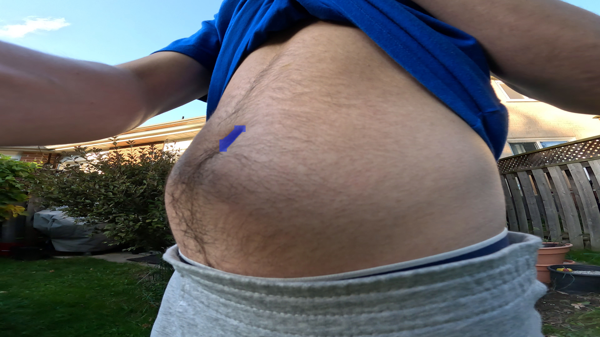
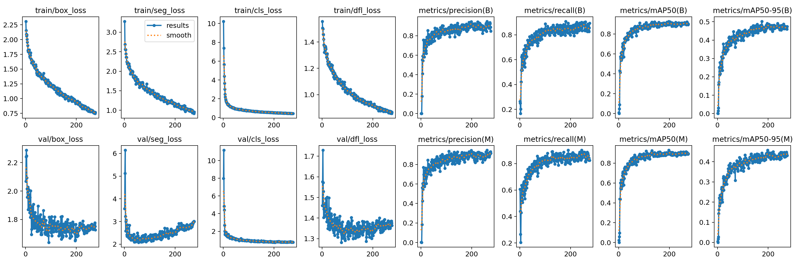

# Injection Tracker: Dataset and Training Report

## Introduction

This project explores whether a modern YOLO-based segmentation model can reliably detect and segment the navel under realistic conditions as a step toward an insulin injection location tracking system. The core question is not only whether the model can achieve high accuracy on controlled data, but whether it can remain robust under variations in lighting, posture, camera distance, and background.

Over the term, I iteratively expanded and refined the dataset, trained a sequence of models, and evaluated their performance and runtime characteristics with an eye toward eventual deployment on a resource-constrained edge device. The report focuses on how specific design choices — data format, dataset structure, image resolution (`imgsz`), and training hyperparameters — affect both segmentation quality and practical feasibility.

## Methods

- **Model and hardware**
  - All experiments used a pretrained Ultralytics YOLO segmentation model (YOLOv11) that was fine-tuned in Python.
  - Training was performed primarily on Google Colab with access to an NVIDIA A100 GPU (40 GB), which automatically determined feasible batch sizes for each `imgsz` configuration.
  - Inference latency was measured on a MacBook Air with an M1 chip.

- **Data collection and labeling**
  - Short videos were recorded under a range of lighting and posture conditions (daylight, indoor lighting, bathroom lighting, outdoor daylight, low-light flashlight), then converted to frames using custom preprocessing scripts.
  - Images were labeled in CVAT to obtain segmentation masks for the navel, with additional negative images (no navel present) to reduce false positives.
  - For the larger dataset, stratified sampling was used to create training/validation splits that preserved the relative proportions of different capture conditions.

- **Evaluation protocol and metrics**
  - Models were evaluated on a held-out validation set for each training run; no separate test set was used in this term’s work.
  - The evaluation metrics are the default metrics used by YOLO:
    - **Precision (P)**: fraction of predicted detections that are correct.
    - **Recall (R)**: fraction of ground-truth objects that are correctly detected.
    - **mAP@50**: mean Average Precision at an IoU threshold of 0.5, capturing overall detection/segmentation quality at a moderate overlap requirement.
    - **mAP@50–95**: mean Average Precision averaged over IoU thresholds from 0.5 to 0.95, which is a stricter and more holistic measure of localization and mask quality.

## Dataset and Training Summary

### First Model: Proof-of-Concept

The first training run served as a proof-of-concept to validate whether a YOLO segmentation model could reliably segment the navel. I collected three short video clips under varying lighting and posture conditions (daylight, indoor lighting, sitting, and standing). Frames were extracted at 3 fps, yielding **264 images** in total. Two-thirds of the frames were used for training, and the remaining **99 images (36.7%)** were held out for validation.  

Although this split was not ideal, the goal was to quickly assess model feasibility. The model was trained for **120 epochs** using YOLO’s default parameters. Despite the small dataset, early results demonstrated promising segmentation performance.

#### Results

Unfortunately, when training the first model, I was unaware of the lack of persistent storage in Colab, so I do not have the graphs generated during training. However, I did capture the final performance metrics for the first model on the validation set:

| Metric | Box | Mask |
|:--|--:|--:|
| Precision (P) | 0.789 | 0.639 |
| Recall (R) | 0.394 | 0.355 |
| mAP@50 | 0.479 | 0.370 |
| mAP@50-95 | 0.145 | 0.099 |

These results, as well as testing on a webcam feed, indicated that the model was indeed able to segment the navel and that there was room for improvement. The next step was to expand the dataset and improve the robustness of the model.

---

### Second Model: Expanded and More Robust Collection

During a live demonstration with Prof. Bruce, the first model exhibited two key issues:

1. **False positives**, e.g., detecting the navel on the ceiling.  
2. **Poor detection** when the abdomen was compressed (e.g., while sitting hunched over).

To address these, I expanded the dataset and introduced **negative images** (frames without a navel). Initially, I separated negatives into their own folder. I later mixed them into the same folders as positive samples, as I thought that it would make no difference. However, I realized that I should have kept the negatives in a separate folder in order to maintain a clear control over the data being included in training. There were 40 negative images in their own folder, along with any negatives that were included implicitly in the other folders. During training, YOLO reported **62 background images**, indicating that 22 negatives were included implicitly. 

Data was captured under a broader range of lighting conditions to improve robustness:
- Flashlight-lit low-light indoor setting  
- Outdoor daylight conditions  
- Bathroom lighting conditions  

All new frames were saved as **PNGs** rather than **JPEGs** (the format used to train the first model). Using PNGs helps preserve high-frequency detail, which is important for the model to learn an accurate segmentation of the navel. This was another oversight on my part, as I should have trained on PNGs from the start. However, it is possible that this change may have encouraged the model to learn more generalizable features due to subtle compression artifacts in the JPEGs.

Otherwise, this model was trained for 300 epochs (vs 120 for the first model), with all other hyperparameters set to YOLO's default values.

#### Dataset Composition

| Folder        | Images |
|:--------------|-------:|
| 1             | 76 |
| 2             | 113 |
| 3             | 157 |
| Bathroom      | 116 |
| Flashlight    | 150 |
| Negatives     | 47 |
| Outdoors      | 70 |
| **Total**     | **729** |

Although there was a mild imbalance across conditions, the dataset size was insufficient to justify truncation. Instead, **stratified sampling** was used to preserve proportional representation between training and validation splits. In future datasets, I will work to ensure conditions are more balanced.

#### Performance Metrics

| Metric | Box | Mask |
|:--|--:|--:|
| Precision (P) | 0.918 | 0.885 |
| Recall (R) | 0.871 | 0.795 |
| mAP@50 | 0.909 | 0.812 |
| mAP@50-95 | 0.443 | 0.312 |

#### Comparison of the performance metrics for the first and second models.

From the metrics, it is evident that this model is much more robust than the first model, and is able to segment the navel in a wider variety of conditions. This was confirmed by testing the model on a webcam feed, where the second model was able to segment the navel when it was compressed, while the first model was unable to do so. It also seemed to exhibit less false positives, which is supported by the higher precision metrics for both box and mask compared to the first model. In the table below, we can clearly see the improvement in performance across all metrics.

| Metric | Box (First Model) | Box (Second Model) | Mask (First Model) | Mask (Second Model) |
|:--|--:|--:|--:|--:|
| Precision (P) | 0.789 | 0.918 | 0.639 | 0.885 |
| Recall (R) | 0.394 | 0.871 | 0.355 | 0.795 |
| mAP@50 | 0.479 | 0.909 | 0.370 | 0.812 |
| mAP@50-95 | 0.145 | 0.443 | 0.099 | 0.312 |

---

### Third Model: Second Dataset, larger image size

While the previous training runs were performed at an image size of 640x640, this model was trained with `imgsz=1280`. YOLO automatically determined the batch size based on the available GPU memory (40GB on the A100 GPU), which turned out to be 16. All other hyperparameters remained the same as the second model.

#### Performance Metrics

| Metric | Box | Mask |
|:--|--:|--:|
| Precision (P) | 0.903 | 0.911 |
| Recall (R) | 0.826 | 0.833 |
| mAP@50 | 0.899 | 0.892 |
| mAP@50-95 | 0.501 | 0.441 |

#### Comparison of the performance metrics for the second and third models.

The metrics are relatively similar, with the third model performing slightly better in box metrics, while the second model performs slightly better in mask metrics. This is likely due to the larger image size, which preserves more detail in the image and corresponding label, providing more context for the model to learn from.

| Metric | Box (Second Model) | Box (Third Model) | Mask (Second Model) | Mask (Third Model) |
|:--|--:|--:|--:|--:|
| Precision (P) | 0.918 | 0.903 | 0.885 | 0.911 |
| Recall (R) | 0.871 | 0.826 | 0.795 | 0.833 |
| mAP@50 | 0.909 | 0.899 | 0.812 | 0.892 |
| mAP@50-95 | 0.443 | 0.501 | 0.312 | 0.441 |

### Fourth Model: Second Dataset, even larger image size

This model was trained at an image size of `imgsz=2560`. YOLO automatically determined the batch size to be 4. All other hyperparameters remained the same as the second and third models.

#### Performance Metrics

| Metric | Box | Mask |
|:--|--:|--:|
| Precision (P) | 0.899 | 0.887 |
| Recall (R) | 0.879 | 0.890 |
| mAP@50 | 0.903 | 0.910 |
| mAP@50-95 | 0.504 | 0.508 |

#### Comparison of the performance metrics for the third and fourth models.

The metrics are again relatively similar, and the increase in image size does not seem to have a significant impact on performance.

| Metric | Box (Third Model) | Box (Fourth Model) | Mask (Third Model) | Mask (Fourth Model) |
|:--|--:|--:|--:|--:|
| Precision (P) | 0.903 | 0.899 | 0.911 | 0.887 |
| Recall (R) | 0.826 | 0.879 | 0.833 | 0.890 |
| mAP@50 | 0.899 | 0.903 | 0.892 | 0.910 |
| mAP@50-95 | 0.501 | 0.504 | 0.441 | 0.508 |

### Effect of `imgsz`

The YOLO `imgsz` parameter defines the maximum side length (in pixels) to which each input image is resized during training and inference. For the default `imgsz=640`, original 3840 × 2160 frames are resized to **640 × 360**, each dimension is padded with zeroes to a multiple of 32, and then finally padded to a square. The size to which the images are resized has a significant impact on the fidelity of the mask as can be seen in the examples below. The inference time was measured on a MacBook Air with an M1 chip.

| Image Size | Inference Time | Notes | Example Image |
|:------------|--------------------:|:------|:--------------|
| 640  | 51.7 ms | Fast; acceptable accuracy |  |
| 1280 | 166.7 ms | Higher mask fidelity |  |
| 2560 | 750.4 ms | Excellent fidelity, impractical speed |  |

While larger image sizes produced more detailed masks, inference latency increased sharply. Additionally, we saw in the comparisons of the performance metrics that the increase in performance from 1280 to 2560 was not as significant as the increase from 640 to 1280. Given these factors, and the final goal of deployment on an edge device (e.g., an insulin pen companion), the **1280 × 1280** configuration likely offers the best balance between detail and performance. 

Another option to consider is to crop images to a square region of interest (ROI) before training. This would allow the model to focus on the navel region while maintaining a higher resolution, resulting in a more detailed mask and potentially improved performance. However, this would require more careful planning to ensure we don't lose too much contextual information and that we don't introduce any bias into the training data.

---

### Utility Scripts

The following custom scripts were used to preprocess and manage data:

| Script | Description |
|:--|:--|
| `convert_video.py` | Converts raw videos to image frames. |
| `count_images.py` | Counts images per folder to verify data balance. |
| `remove_flashlight_unlabelled.py` | Removes unlabeled images inadvertently exported by CVAT. |
| `train_val_split.py` | Performs stratified train/validation splitting. |

### Demo Scripts

These scripts were used to generate the results and demos throughout the project:

| Script | Description |
|:--|:--|
| `live_segmentation_demo.py` | Runs a segmentation model on a live webcam feed. |
| `video_segmentation_demo.py` | Segments a video using a segmentation model and saves the results. |
| `pose_estimation_demo.py` | Estimates the camera's pose on a live webcam feed using the mask generated by a segmentation model. |
| `imgsz_demo.py` | Visualizes the fidelity of the predicted mask at different image sizes. |

---

## Training Graphs

### First Model
Recall that the training graphs for the first model are not available.
### Second Model

### Third Model

### Fourth Model

For all models, the training loss steadily decreases for both box and mask. While the validation loss for box also steadily decreases, the validation segmentation loss starts to increase after about 100 epochs, indicating that the model is overfitting. This is particularly evident in the fourth model, where the validation segmentation loss has the sharpest increase, likely due to the small batch size of 4 required at this image size. The smaller batch size introduces noisier estimates of the gradient of the loss function, leading to less stable gradients and impacting the model's ability to learn robust features.

In order to address this next term, I will experiment with adjusting the hyperparameters of the model to improve generalization. I will also explore further data augmentation techniques, such as rotation, scaling, and shearing. In addition to collecting more data, I will also try to implement regularization techniques, such as weight decay and dropout.

---

## Pose Estimation

Though the main focus this term was to develop a segmentation model, I tried estimating the camera's pose using the mask generated by the segmentation model. This was done by using the segmentation model to generate a mask of the navel, extracting keypoints from the mask, and then using the keypoints to estimate the camera's pose. The pose estimation script was generated by an LLM. The GIF below shows the results of using the second model for pose estimation. 

Although the pose estimation is not perfect, it is a promising result. Additionally, I would like to augment the pose estimation with additional sensors, such as an IMU or ToF sensor, and alternative pipelines, such as a sensor fusion approach using a Transformer.

---

## Improvements and Next Steps

The following improvements and next steps will be explored in the next term:

- **Model and training**
  - Collect additional data, especially under rare or challenging conditions, and maintain clearer dataset organization (descriptive folder names, explicit separation of negatives) to preserve clean splits and balanced representation across lighting and posture.
  - Experiment with hyperparameters (e.g., learning rate schedule, weight decay, dropout) to improve generalization and reduce the overfitting seen in the segmentation loss curves.
  - Systematically evaluate stronger augmentations (rotation, scaling, shearing, brightness/contrast changes, noise) using Albumentations beyond YOLO’s defaults.

- **Data and preprocessing**
  - Standardize the training and inference resolution (e.g., prefer `imgsz=1280` based on the current accuracy–latency trade-off) and benchmark inference at this resolution on the target edge hardware.
  - Investigate cropping to a square region of interest around the abdomen so the model can operate at a higher effective resolution without incurring the full-frame cost, while ensuring sufficient context is preserved and bias is not introduced.
  - Use model-assisted (automatic) annotation in CVAT to efficiently expand the labeled dataset.

- **Pose estimation pipeline**
  - Perform camera calibration and integrate it into the pose-estimation script so that estimated positions are expressed in a physically meaningful coordinate frame.
  - Explore alternative pose-estimation pipelines that exploit temporal information (e.g., a Transformer or other sequence model over masks and past frames) and explicitly leverage the geometry of the predicted mask.
  - Explore sensor fusion with additional hardware (IMU, ToF or depth sensors) to improve robustness to motion and occlusions.
  - Consider NVIDIA simulation tools to generate synthetic training data.

- **Project focus for next term**
  - Defer complex 3D hardware design in favor of building a compact camera + IMU/ToF prototype and iterating on a robust segmentation-and-pose pipeline that can eventually transfer to an insulin-pen-like device.

---

## Lessons Learned

Transitioning from theoretical understanding to practical implementation in computer vision involves significant operational and organizational complexity. Beyond model theory, success requires careful dataset management, systematic documentation, and iterative experimentation.  

Initially, I used non-descriptive directory names (e.g., “1,” “2,” “3”), which can become cumbersome as the dataset grows. Similarly, my initial treatment of negative images revealed the importance of explicit dataset structuring and labeling discipline.  

I also learned that model performance depends not only on algorithm choice but on many interrelated factors: hyperparameters, data format (JPEG vs PNG), train/validation strategy, and environmental variability (lighting, posture, camera distance, resolution). Each factor influences how well a model generalizes beyond controlled conditions — a critical insight for future applied ML projects.

---

## Conclusion

Over the course of several training runs, the project progressed from a small proof-of-concept model to a substantially more robust segmentation system trained on a larger, more diverse dataset. Quantitatively, the best models improved mask performance from an initial mAP@50 of 0.370 to over 0.890, while also significantly increasing box-level precision and recall.

At the same time, systematic experiments with image size (`imgsz`) showed that larger inputs improve mask fidelity but incur substantial latency costs, especially at `imgsz=2560`. Based on the balance between accuracy and runtime, an `imgsz` of 1280 currently appears to be the most promising configuration for an eventual edge deployment.

Looking ahead, the next phase of work will focus on strengthening generalization through better data organization, augmentation, and regularization; refining the pose-estimation pipeline (including camera calibration and sensor fusion); and iterating toward a compact hardware prototype that can support real-time segmentation and pose estimation in realistic usage scenarios.
